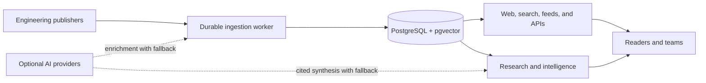

# UniBlog

## The intelligence layer for how the world's best engineering teams build

Engineering knowledge is published every day across company blogs, research journals, architecture posts, security
advisories, and technical white papers. The signal is valuable, but fragmented across hundreds of websites and buried
under general-purpose search and social feeds.

**UniBlog turns that fragmented public knowledge into a searchable, personalized, and continuously updated engineering
intelligence platform.**

It is designed for software engineers, technology leaders, researchers, investors, analysts, and vendors who need to
understand what leading technology organizations are building—and why it matters.

> Current stage: working, production-oriented MVP seeking strategic investment, commercialization partners, or an
> acquisition conversation. No revenue or user-traction claims are implied by this document.

## The opportunity

The world's engineering organizations already publish a high-value stream of technical information. Today, extracting
useful intelligence from it remains mostly manual:

- Engineers repeatedly visit individual blogs or depend on noisy social feeds.
- Technology leaders struggle to compare architecture and adoption signals across companies.
- Developer-tool companies lack a reliable view of emerging technical demand.
- Investors and analysts spend time assembling evidence about engineering direction and technology adoption.
- Internal research is difficult to preserve, share, cite, and revisit.

UniBlog can become the system of record for this public engineering knowledge: part professional reader, part research
workspace, and part technology-market intelligence platform.

## What is already built

UniBlog is more than a landing page or concept prototype. The current product includes:

- Continuous discovery from a curated catalog of **250 English-language engineering sources**.
- RSS, Atom, HTML, and WebSub ingestion with conditional requests and adaptive polling.
- Full-text search, trending stories, company and topic pages, curated collections, comparisons, and engineering radar.
- Publisher-attributed article insight pages with canonical metadata and original-source links.
- Personal follows, bookmarks, reading history, notes, saved searches, reading goals, and private RSS feeds.
- Daily and weekly engineering email digests with timezone-aware delivery and unsubscribe handling.
- Optional AI summaries, technical takeaways, embeddings, semantic search, learning paths, and cited research synthesis.
- A fully functional deterministic mode when AI is disabled or unavailable.
- Administrative source health, ingestion history, queue visibility, indexing status, and retry operations.
- OpenTelemetry metrics, logs, traces, health probes, structured logging, and Grafana-compatible observability.
- Security controls for authentication, authorization, CSRF, SSRF, rate limiting, bounded downloads, and content removal.
- Responsive server-rendered pages, sitemap segmentation, structured data, canonical URLs, and index-bloat controls.

The latest local acceptance snapshot processed all 250 configured sources successfully with no latest HTTP 40x or
ingestion errors. The clean automated reactor currently contains **77 passing tests** across core, migration, web,
worker, and architecture modules. These are engineering validation results—not claims of market traction or guaranteed
future availability.

## Product experience

### For individual professionals

Users get a calm, personalized stream of engineering knowledge instead of another engagement-optimized social feed.
They can follow companies and topics, save articles, add private notes, receive scheduled digests, export feeds, and
track their learning over time.

### For technology teams

The platform can evolve into a shared engineering-intelligence workspace: collaborative watchlists, research
collections, annotations, weekly reports, private sources, exports, and evidence-backed architecture research.

### For market intelligence

UniBlog's normalized corpus can power technology-adoption timelines, company comparisons, ecosystem maps, engineering
hiring and investment signals, and category-level trend reports—all grounded in attributable public sources.

## Why UniBlog is differentiated

| General alternatives | UniBlog |
|---|---|
| Search returns pages for one query | Builds a continuously refreshed engineering corpus |
| Social feeds optimize for engagement | Optimizes for technical relevance and learning |
| RSS readers organize subscriptions | Normalizes, classifies, compares, and researches across sources |
| Generic AI can produce unsupported answers | Research is source-grounded and citation-oriented |
| AI-first tools fail when a model is unavailable | Core discovery and personalization continue without AI |
| Market databases focus on financial/company metadata | Focuses on evidence published by engineering organizations |

The product's defensibility can compound through source-quality operations, historical normalized data, technology
taxonomies, user intent signals, proprietary rankings, research workflows, and trusted distribution—not merely through
access to a language model.

## A capital-efficient architecture

UniBlog is intentionally designed to grow without beginning as an expensive distributed system.

The modular Java platform produces separate web, worker, and one-shot migration artifacts. PostgreSQL holds content,
jobs, delivery state, search indexes, and vectors transactionally. This reduces infrastructure sprawl while preserving
clear paths to independent scaling.

Core technologies include Java 25 virtual threads, Spring Boot 4, Spring Modulith, PostgreSQL 17, pgvector, Flyway,
OpenTelemetry, Testcontainers, and standards-based SMTP.

## Business model

UniBlog supports several complementary revenue paths:

1. **Professional subscriptions** — advanced watchlists, saved research, custom digests, exports, semantic discovery,
   and AI-assisted analysis.
2. **Team workspaces** — shared collections, notes, reports, permissions, private sources, and collaboration.
3. **Enterprise intelligence** — SSO, audit controls, internal-source connectors, custom taxonomies, retention policies,
   and dedicated deployments.
4. **Data and API products** — technology-adoption signals, normalized metadata, trend indexes, and licensed datasets.
5. **Sponsored research** — clearly disclosed ecosystem reports and category intelligence without compromising ranking
   independence.
6. **Strategic licensing or acquisition** — integration into developer platforms, research products, professional
   networks, observability vendors, technical publishers, or market-intelligence businesses.

Illustrative validation ranges—not current pricing—are $10–15/month for an individual professional plan,
$20–30/user/month for team intelligence, and negotiated annual enterprise or data contracts.

## Go-to-market thesis

The initial growth loop can be built around valuable public assets rather than paid acquisition:

- Publish a recurring **State of Engineering Blogs** report.
- Release technology-adoption dashboards and embeddable engineering radars.
- Create high-intent company and topic research pages backed by original analysis.
- Build newsletter partnerships with engineering communities and technical podcasts.
- Offer a useful public API, selected open datasets, and developer integrations.
- Convert individual readers into team workspaces through shared research and weekly reports.

Every original report can attract backlinks and subscribers; every new reader improves topic and source relevance; every
new source expands the research corpus. This creates a content, data, and distribution flywheel.

## Near-term commercialization roadmap

### Phase 1 — Launch and validate

- Establish reliable managed hosting and a public domain.
- Recruit design partners among engineering leaders, analysts, and developer-tool companies.
- Measure activation, weekly retention, digest engagement, search success, and willingness to pay.
- Publish original benchmark reports that demonstrate the value of the corpus.

### Phase 2 — Monetize professionals and teams

- Introduce billing, entitlements, usage limits, invoices, and subscription lifecycle management.
- Add team workspaces, shared research, watchlists, alerts, and scheduled intelligence reports.
- Support private RSS, internal engineering blogs, Markdown/PDF exports, and browser capture.

### Phase 3 — Build the intelligence network

- Launch company and technology adoption dashboards with transparent evidence.
- Offer enterprise governance, API access, dataset licensing, and private deployments.
- Expand taxonomies and coverage while maintaining strict language, quality, attribution, and licensing policies.

## What investment accelerates

Funding would primarily accelerate:

- Product design and customer discovery with professional and enterprise users.
- Managed production infrastructure, security operations, backups, and reliability engineering.
- Editorial research and proprietary benchmark datasets.
- Team collaboration, billing, enterprise identity, integrations, and API commercialization.
- Distribution through reports, partnerships, developer relations, and targeted sales.
- Legal, licensing, privacy, and publisher-relationship operations at commercial scale.

The objective is not to spend heavily on undifferentiated model usage. AI is applied selectively, with token controls,
circuit breakers, and non-AI fallbacks so unit economics remain governable.

## Strategic fit

UniBlog may be especially relevant to:

- Developer tooling, cloud, data, cybersecurity, and observability companies.
- Professional networks, technical media, and engineering-community platforms.
- Research, competitive-intelligence, and technology-market-data businesses.
- Venture funds and corporate strategy teams tracking technical adoption.
- Learning platforms and enterprise knowledge-management vendors.

Potential transaction structures include seed or angel investment, a strategic development partnership, data
licensing, commercial joint venture, IP and product acquisition, or acquisition of the project as a foundation for a
larger engineering-intelligence offering.

## Open source and commercial defensibility

The current core is available under Apache License 2.0. An open core can accelerate trust, integrations, source
contributions, and developer adoption. Commercial value can be built through the hosted network, continuously operated
dataset, collaboration layer, proprietary rankings and reports, enterprise controls, integrations, support, and brand.

## Start a conversation

If you are an investor, operator, potential acquirer, or design partner interested in building the leading engineering
intelligence platform, contact the [project owner on GitHub](https://github.com/inbox-pj).

Useful conversations include:

- Funding and company formation.
- Product or intellectual-property acquisition.
- Strategic distribution and data partnerships.
- Paid design partnerships and enterprise pilots.
- Technical due diligence and product demonstrations.

Detailed architecture, security controls, tests, deployment materials, and the working application can be made
available for qualified diligence.

---

Copyright 2026 UniBlog contributors. Licensed under the [Apache License 2.0](LICENSE).
