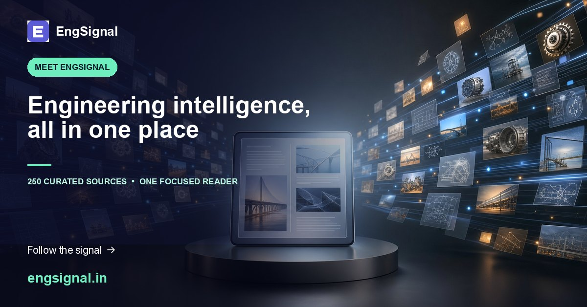
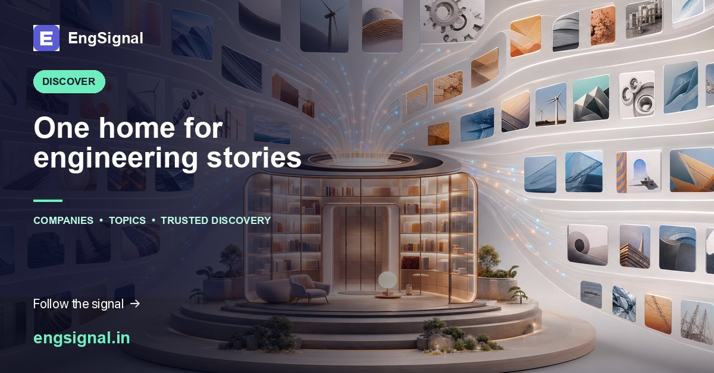
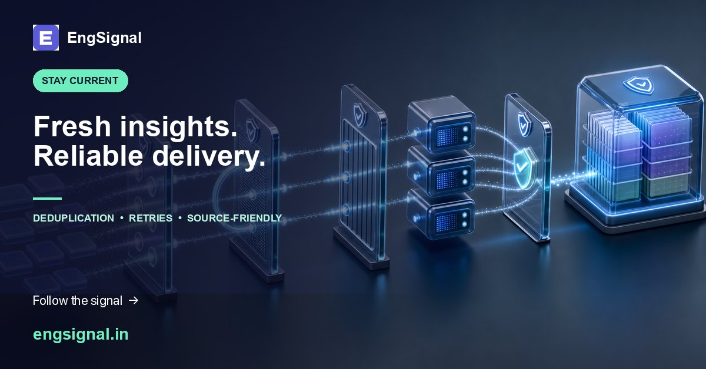
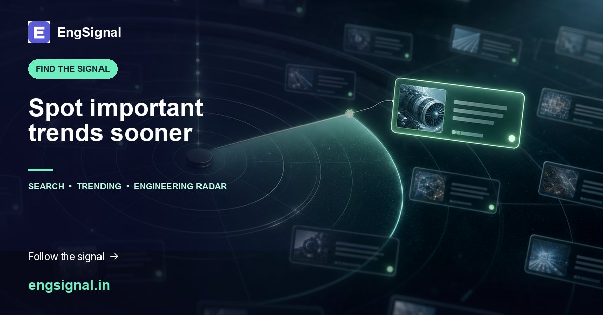
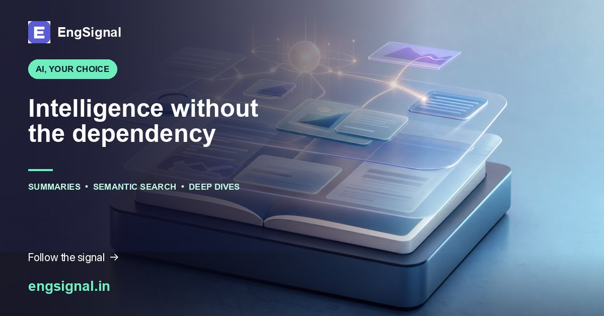
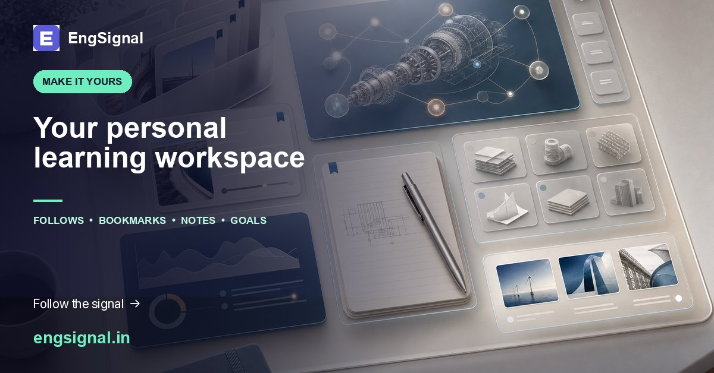
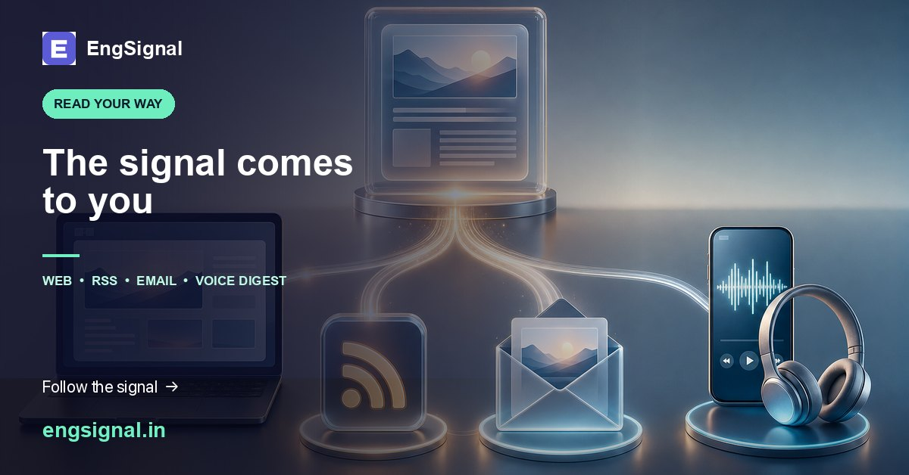
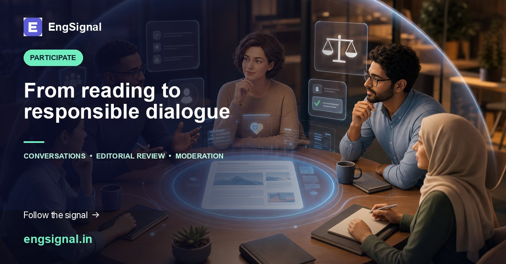
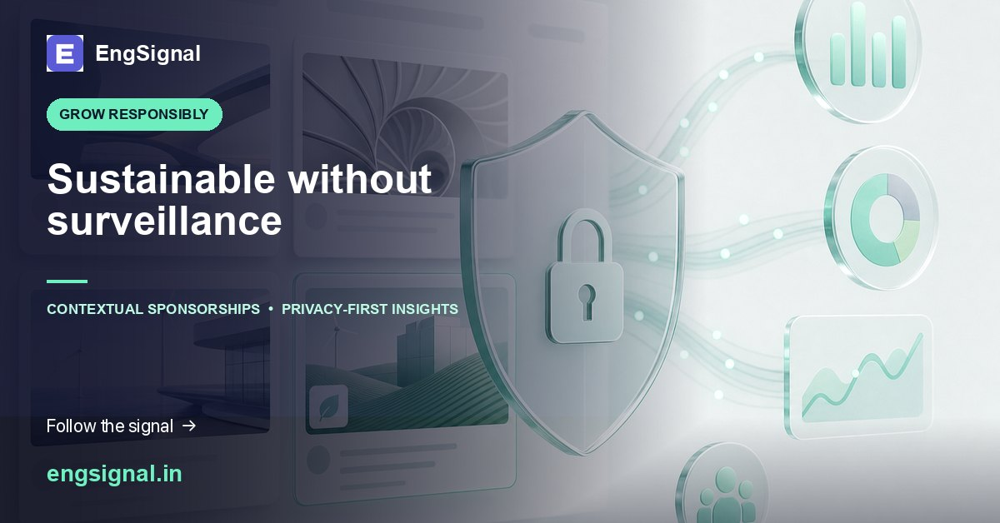
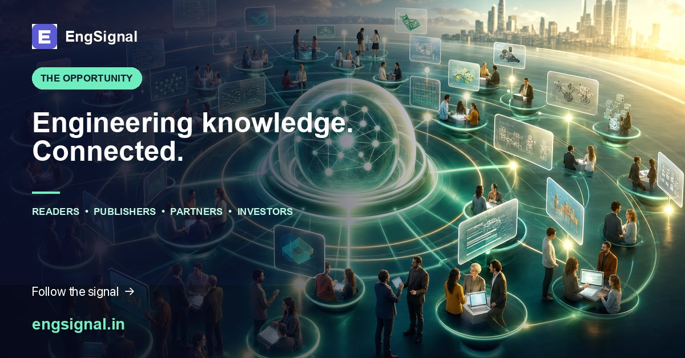

# EngSignal: 10-Week LinkedIn Launch Campaign

Visual direction for the series: premium editorial technology imagery, deep navy-to-violet EngSignal palette, subtle
mint accents, clean lighting, generous negative space, 3:2 landscape composition, and no embedded text, logos, or
watermarks.

## Week 1 — Meet EngSignal 👋

What if the best engineering lessons from leading technology teams were available in one place? 🔎

Meet **EngSignal**—a focused engineering-intelligence reader built to help you discover trusted stories, compare ideas,
learn faster, and follow the technologies shaping what comes next.

This is only the beginning. Follow our 10-week feature reveal and **watch this space** as we show what EngSignal can do.
🚀

#EngSignal #Engineering #TechLeadership #DeveloperCommunity

## Week 2 — One Home for Engineering Stories 🧭

Too many tabs. Too many feeds. Too much noise. Sound familiar?

EngSignal continuously discovers and organizes engineering stories from **250 curated organizations**—giving you one
clean place to browse the latest thinking by company or topic.

Spend less time hunting and more time learning. 📚

The market opportunity is clear: fragmented engineering knowledge is waiting for a trusted discovery layer.

Building or investing in developer productivity and knowledge platforms? **Follow along and watch this space.**

#EngineeringBlogs #SoftwareEngineering #KnowledgeSharing #EngSignal

## Week 3 — Reliable Ingestion Behind the Reader ⚙️

Fresh insights are valuable only when the content behind them is dependable.

EngSignal continuously checks trusted sources, detects new stories, avoids duplicates, retries failures, and recovers
interrupted work—without slowing down your reading experience or overwhelming publishers.

You get a fast reader and consistently fresh engineering knowledge. ⚡

Next: how EngSignal helps you spot important trends sooner. **Watch this space.**

#BackendEngineering #SystemDesign #Reliability #EngSignal

## Week 4 — Find the Signal Faster 📡

The article you need should not disappear inside an endless feed.

EngSignal combines powerful search, trending stories, company and topic pages, curated collections, comparisons, and an
engineering radar—so you can move from information to insight faster.

Search less. Spot patterns sooner. Make better-informed technology decisions. 🔎

Follow EngSignal—next week we reveal how AI adds value **without becoming a dependency**.

#EngineeringTrends #Search #TechnologyRadar #EngSignal

## Week 5 — AI That Is Optional by Design ✨

AI should make a product better—not hold it hostage.

Turn it on for summaries, technical takeaways, semantic search, related stories, and guided deep dives. Turn it off and
EngSignal’s core discovery, search, personalization, feeds, and administration still work.

Useful by default. Intelligent by choice. ✅

That flexibility is more than a feature—it is product differentiation in a market crowded with AI-only experiences.

Interested in resilient AI products and engineering intelligence? **Follow EngSignal and watch this space.**

#ResponsibleAI #EngineeringIntelligence #AI #EngSignal

## Week 6 — Your Personal Engineering Workspace 🎯

Reading is useful. Building a learning system is powerful.

With EngSignal, you can follow companies and topics, bookmark stories, save searches, add private notes, track reading
history, set goals, and receive personalized notifications.

Your interests. Your workspace. Your pace. 🎯

A focused reader becomes a recurring learning habit—creating meaningful long-term value and engagement.

If the future of professional learning interests you as a user, partner, or investor, **follow the journey.**

#Personalization #ContinuousLearning #EngineeringGrowth #EngSignal

## Week 7 — Read It Your Way 🎧

Your learning workflow should adapt to you—not the other way around.

Choose public or personal RSS, import and export subscriptions with OPML, receive daily or weekly email digests, or
listen through a browser-powered Voice Digest.

Open the reader—or let the signal come to you. 📬

Multiple delivery channels create more ways to build habit, retention, and organic distribution.

See potential in developer-focused knowledge products? Let’s connect—and **watch this space** for the community layer.

#RSS #EmailDigest #DeveloperProductivity #EngSignal

## Week 8 — From Reading to Participation 💬

The best engineering knowledge grows through thoughtful discussion.

EngSignal enables article conversations, community feedback, editorial review campaigns, and contributor
submissions—with reporting, blocking, appeals, and moderation built in for responsible participation.

Not just another content feed—a space designed for constructive engineering dialogue. 💬

Follow EngSignal. Next week, we reveal a privacy-conscious approach to sustainable growth.

#DeveloperCommunity #Collaboration #ContentModeration #EngSignal

## Week 9 — Sustainable Without Surveillance 🛡️

Can a knowledge platform create commercial value without turning readers into tracking profiles? We believe it can. 🛡️

EngSignal supports contextual sponsorships, creative review, campaign controls, aggregate reporting, ad-free access,
legal policies, and content-removal workflows—without storing user IDs, IP addresses, or advertising IDs in sponsorship
events.

Relevant for partners. Respectful for readers. Sustainable by design.

This opens a business-model opportunity around high-intent engineering audiences without surveillance advertising.

We are looking to connect with aligned partners and investors. The final reveal brings the full opportunity together—
**follow us and watch this space.**

#PrivacyByDesign #Sponsorship #EthicalTech #EngSignal

## Week 10 — The Opportunity Ahead 🚀

Engineering knowledge is growing—but it remains fragmented across company blogs, feeds, and platforms. That
fragmentation is the opportunity. 🌍

EngSignal creates one focused intelligence layer where people can discover trusted stories, understand emerging themes,
personalize learning, and connect with a high-intent engineering audience.

For readers: time saved and better insight. For publishers: stronger discovery. For responsible partners: relevant
reach. For the market: a clearer view of how technology is actually being built.

We are building where engineering knowledge, community, and opportunity meet. **Interested in the product, partnership,
or investment journey? Let’s connect—and watch this space for what comes next.** 🤝

#Startup #EngineeringIntelligence #MarketOpportunity #FutureOfWork #EngSignal

